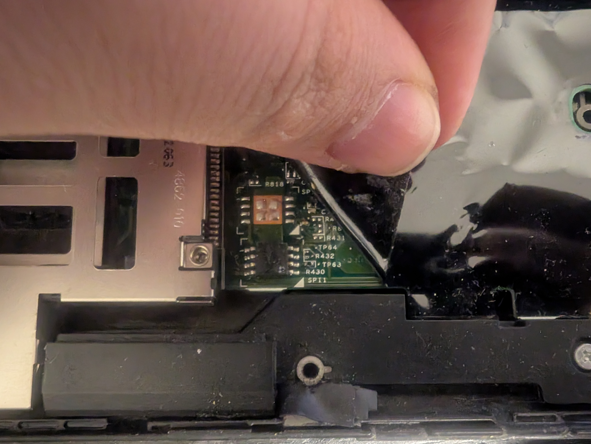
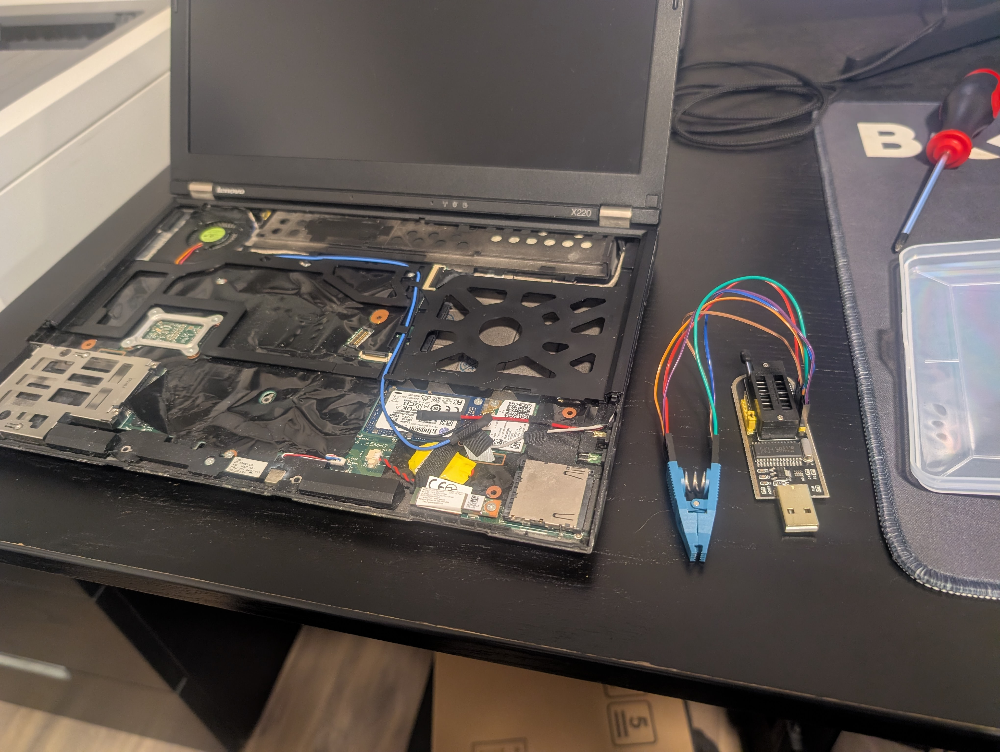

After many years of owning my ThinkPad X220 I have finally decided to install Libreboot on it. I wanted to do a year ago and infact I bought a **CH341A BIOS programmer** last year, but after trying to place the clip that came with it on the BIOS chip I decided to not go through with it because the connection felt flimzy and the clip would not stop poping off...\n\n 

But a few weeks ago I browsed AliExpress and I was to find an original **pomona SOIC 8 pin clip** for only 7$ which is a huge bargain since last year I looked for one the price was in the 70$ range 🤯. So after I got the pomona clip and I had some free time I went through the installation.


    
### The tools I used for installing Libreboot:

- CH341A BIOS programmer
- pomona 8-pin SOIC clip
- 6 female to female wires
- screwdriver



---

First thing was to download the [latest release of Libreboot]("https://libreboot.org/download.html") from the offical site and cloning [the build system reposetory]("https://codeberg.org/libreboot/lbmk") to add the vendor files to the Libreboot ROM image before burning it.\n\n 

Then I disassembled my ThinkPad which is really easy (you can find a guide in the links bellow) and then I located the BIOS chip which is on the left side under the anti static sticker as can be seen in the image bellow.



Then I used the BIOS chip diagram bellow to wire up the pomona clip to the CH341A programmer.


```text

   Screen (furthest from you)
              __
   MOSI  5 --|  |-- 4  GND
   CLK   6 --|  |-- 3  N/C
   N/C   7 --|  |-- 2  MISO
   3.3v  8 --|__|-- 1  CS

   N/C = Not connected / Not used

   Edge (closest to you)

```





Now was is left to do is to place the clip on the chip and make sure it sits firmly on it and only then connecting the programmer to the PC on which we are going to burn Libreboot with.

.")

Now the annoying part... After already connecting the programmer to my PC, the offical Libreboot guide says that you should not use the CH341A programmer because it might fry your BIOS chip 🤦🏻. Well.. I was already to far gone in the proccess and I read in more sites that other people had success using the CH341A for this job and all went well so I continued the installation. At this point I stopped following the offical guide and used **flashrom** instead of **flashprog** to read and write to the chip since it has built in support for the CH341A programmer. After preforming 3 successful reads of the chip and using **diff** to make sure all them are the same, I flashed the Libreboot image containing the cool deer splash screen and matching my keyboard layout which took a few good minutes. Then I did one more read and ran diff against the ROM I just flashed to make sure they are the same. Then I disconnected the programmer from the PC and carfuly removed the clip and reassembled the laptop. And now for the moment of truth...

")

I booted my laptop and all was well, however installing Libreboot made linux think I have another phantom monitor attached and it made Hyprland act weird so I hade to disable it from my Hyprland config file.\n\n 

Overall I'm glad I installed Libreboot on my ThinkPad and I think that anyone who owns a ThinkPad capable of being Librebooted should go with it. If you want to install Libreboot on your ThinkPad and need any help with that feel free to message me.

---

### Sources I used for help

- <https://libreboot.org/>
- <https://mcdonnelltech.wixsite.com/x220>
- <https://youtu.be/ktcvWkEVBE0>
- <https://garcia.casa/posts/installing-coreboot-on-a-thinkpad-x220/>
- <https://luflow.net/blog/flashing-coreboot-on-a-lenovo-thinkpad-x220-with-a-ch341a-usb-programmer-tutorial/>
