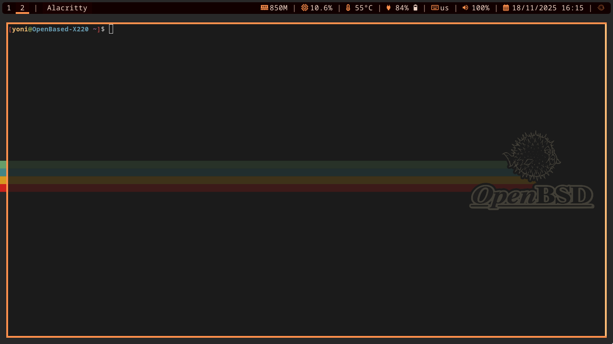

I’ve been curious about OpenBSD for a long time, but always treated it as a *server OS* or something you SSH into — not something you actually sit in front of all day.

A few months ago I decided to change that and try running **OpenBSD as my daily desktop**, on real hardware, for real work.

This post is not a guide.  
It’s just my experience: what surprised me, what worked extremely well, and what ultimately didn’t.

You can check out [my OpenBSD dotfiles](https://github.com/YonatanShaked/OpenBSD-Dotfiles) here, I keep them in case I will move back to OpenBSD in the future.


OpenBSD works surprisingly well as a desktop and has the best init system I’ve ever used.
The system is consistent, well-documented, and feels predictable in a way most modern OSes don’t.

That said, laptop battery life is **significantly** worse than Linux, which makes it hard to recommend for mobile use.
Great for learning and for desktops — not ideal for laptops (yet).


---

## Hardware

I ran OpenBSD on my **ThinkPad X220**.

It’s not new hardware, but it’s a machine I know very well and have used with Linux for years. That made it easy to notice what OpenBSD does differently — for better or worse.

---

## The good

### The init system (seriously)

This was the biggest and most unexpected win.

OpenBSD’s init system is easily the **most user-friendly init system I’ve ever used**.  
Even compared to OpenRC — which I already like — this feels cleaner and more predictable.

- Simple, readable config
- No hidden magic
- Things start when you tell them to start
- Things stop when you tell them to stop

There is a very strong feeling that the system is *on your side*, not fighting you.

I never had moments of “why is this running?” or “who started this?”.  
Everything is explicit, boring, and reliable — which is exactly what I want from init.

---

### Documentation and consistency

OpenBSD’s man pages deserve their reputation.

They’re:

- consistent
- written in plain English
- actually explain *why* things exist

I rarely had to search random blog posts or StackOverflow threads.  
Most of the time, `man` was enough.

That alone makes the system feel calmer to work with.

---

### Desktop setup

I ran a minimal setup:

- bspwm
- sxhkd
- sndio
- picom
- rofi

Once set up, the desktop itself was **stable and predictable**.  
No crashes, no weird rendering issues, no random breakage.

---

## The bad

### Battery life (deal-breaker)

The biggest downside by far: **battery life is awful**.

And I don’t say this lightly — I really tried.

No matter what I did:

- tweaking power settings
- reading docs
- following recommendations
- experimenting with different configs

The battery life on my X220 was **significantly worse than Linux**, and not by a small margin.

For a laptop, this matters.  
A lot.

If this were a desktop machine, I could live with it.  
On a laptop, it became impossible to ignore.

---

### sndio weirdness (and a browser bug)

I ran into a very strange sndio issue that took me a while to understand.

If I ran `sndiod` as a **daemon**, audio would work for some applications — but **not in browsers**.

The fix was unintuitive:

- run `sndiod` as a regular process
- start it from `.xsession`

Once I did that, browser audio worked perfectly.

This is not a huge problem once you know it, but it *is* the kind of thing that can drive you insane if you don’t.

I’m noting it here because it’s obscure and easy to miss.

---

## Learning resources

These were extremely helpful while setting everything up:

- <https://www.youtube.com/@TheOpenBSDguy>  
- <https://www.youtube.com/@chimera_dnb> (rootbsd)  
- <https://www.youtube.com/@ZaneyOG>  

---

## So… would I recommend it?

It depends.

If:

- you’re curious
- you like understanding your system deeply
- you enjoy simplicity and correctness over convenience
- you’re running a desktop or plugged-in machine

Then **yes**, absolutely try it.

If:

- you need good battery life
- you rely on laptop mobility
- you want things to “just work” with minimal effort

Then **Linux is still the better choice** today.

I’m really glad I tried OpenBSD as a desktop.  
Even if I don’t daily-drive it long-term, I learned a lot - that alone was worth it.
