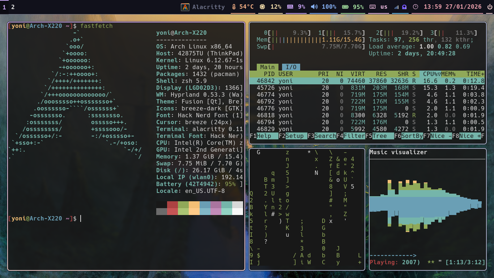
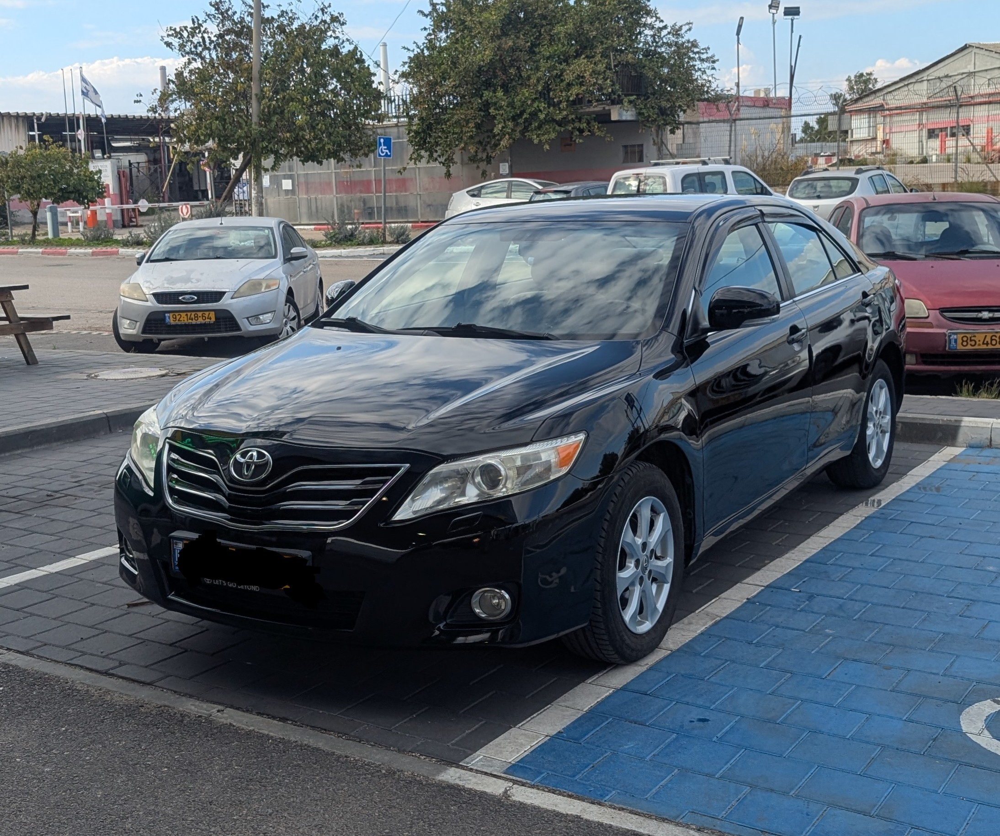

This is a page of every tech that I use on a daily basis.

My ideal way of using a computer or tech in general is to be as efficient and simple as possible, and essentially “work at the speed of thought, every time”. My minimal configuration helps me achieve that, but it may not be for everyone.

You can check out my [dotfiles](https://github.com/YonatanShaked/Arch-Dotfiles) on GitHub.

If you're looking for something that's not listed on this page, feel free to [contact me](/contact) and ask.

## Hardware

- My daily-use laptop is a **ThinkPad X220**. It is lightweight, relatively fast for day-to-day tasks, and most of all really upgradable. I have upgraded the RAM to 16GB, installed an mSATA drive, changed to an IPS panel, installed a new Wi-Fi card, and most importantly replaced the stock BIOS with Libreboot.

- For my workstation laptop, I use a **ThinkPad P15 Gen 2**. Yes, modern ThinkPads are still based. The build quality is great, and they're also available at reasonable prices online if you buy used or refurbished. However, they're not as upgradable as they once were, so keep that in mind. I usually only use this laptop at home since it’s quite chunky to carry around, unlike my X220.

- I also have a desktop PC with a Ryzen 5600X and RTX 3060 Ti. I built it back in late 2020 and plan to keep it around as-is for a long time due to the absurd hardware prices caused by the AI boom.

## Software

- For my operating system, I use **[Arch Linux](https://archlinux.org/)**. It's the only Linux distribution that gets out of my way and just lets me do my work. It's very minimal and easy to use after you get over the initial learning curve, and it's definitely worth the investment.

- **[Hyprland](https://hypr.land/)** is my laptop window manager. For my workflow, a tiling window manager is essential (especially on laptops) once you get over the learning curve. Hyprland uses Wayland and also has some nice animations. Previously, I used DWM, but I decided to move to Wayland.

- **[KDE](https://kde.org/plasma-desktop/)** is the desktop environment I run on my main PC. It can be heavily customized to fit my needs. I like using a more traditional desktop environment with a keyboard-and-mouse setup.

- **[Alacritty](https://alacritty.org/)** is the terminal I use. It's very customizable while still being extremely fast. For my shell, I use **[zsh](https://www.zsh.org/)** with plugins for syntax highlighting and auto-completion.

- For my web browser, I use **[Brave](https://brave.com/)**. I've tried every other browser, and Brave—despite its flaws—remains the best for my use case.
  - Browser extensions I use: **[uBlock Origin](https://ublockorigin.com/)** to block ads and trackers, **[DecentralEyes](https://decentraleyes.org/)** for additional tracking protection, and **[Bitwarden](https://bitwarden.com/)** for password management.

## Services

- For email, I use **[Proton Mail](https://proton.me/mail/)**. Despite the haters, it's still the best privacy-respecting email service out there for most people. I pay for custom domain email, and it’s the best email experience I’ve had to date. If you use the webmail, you get all the modern niceties of something like Gmail without the creepy tracking.

- **[Bitwarden](https://bitwarden.com/)** is the best password manager. It does everything you could need, and the premium subscription—if you want a few extra features—is dirt cheap.

- I use **[Namecheap](https://namecheap.com/)** to purchase my domains. Great prices and customer support make this a no-brainer for me. I've been using them for years with no complaints. Whatever you do, do *not* use GoDaddy.

## Applications

- I use **[Neovim](https://neovim.io/)** for all of my writing. Vim notoriously has a steep learning curve, but as with most things, the payoff is worth it.

- **[VSCodium](https://vscodium.com/)** is my preferred code editor for larger projects. VSCodium is VS Code without the Microsoft telemetry.

- I use the terminal file manager **[lf](https://github.com/gokcehan/lf/)**. It's very fast, highly customizable, and supports image previews via a custom script.

- For email, I use **[Thunderbird](https://www.thunderbird.net/)**. I have my annoyances with it, but it’s still the best email client available on Linux.

## Theme

- I use both **[Catppuccin](https://github.com/catppuccin/catppuccin)** color scheme and the color scheme used in this site for pretty much everything.
- For a font I use the **Hack Nerd Font**, nerd fonts are awesome and I really like their icon system.

## This Website

- This site is built with **[Hugo](https://gohugo.io/)**, a static site generator that outputs plain HTML and CSS instead of the bloated mess that is most of the modern web.

## Phone

- I use a **Google Pixel 8** running **[GrapheneOS](https://grapheneos.org/)**. GrapheneOS is the only mobile OS that truly lets you own your phone.

## Car

- I drive a **2011 Toyota Camry**. This is the ultimate “just works” car, and as a bonus, it’s also good-looking and reasonably powerful for the average car in Israel.

